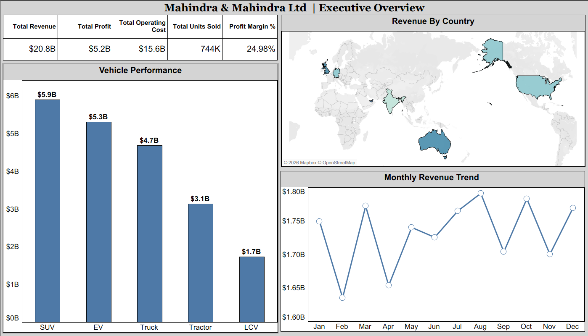
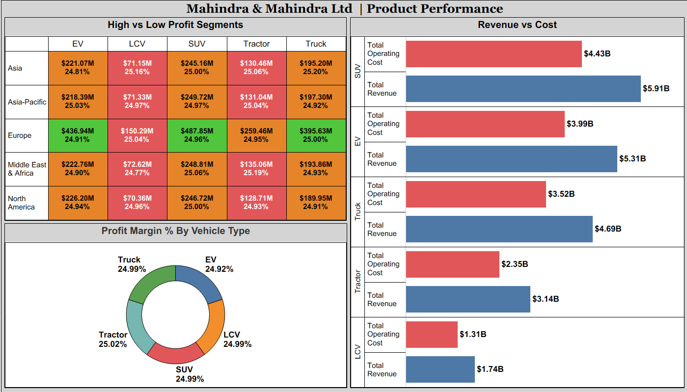
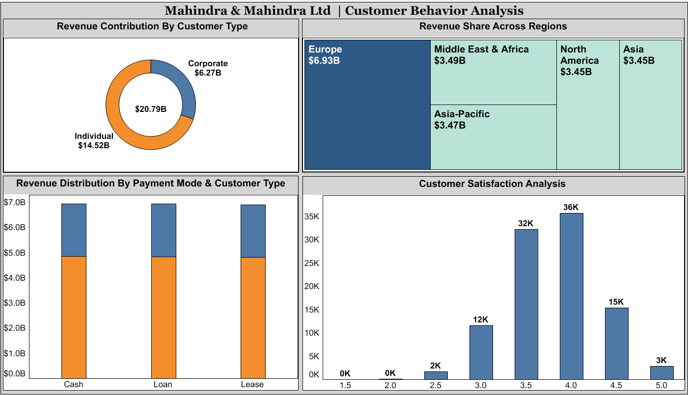
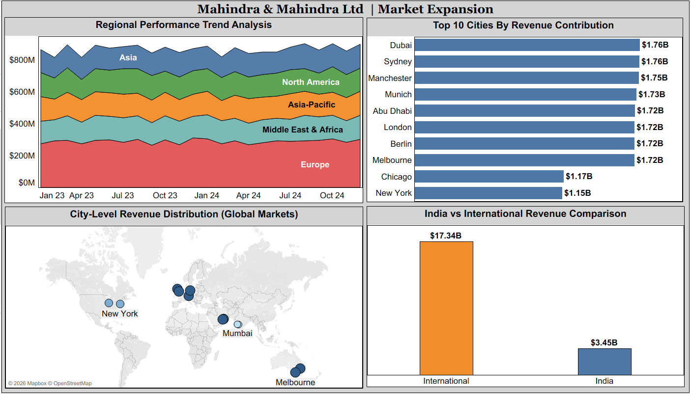
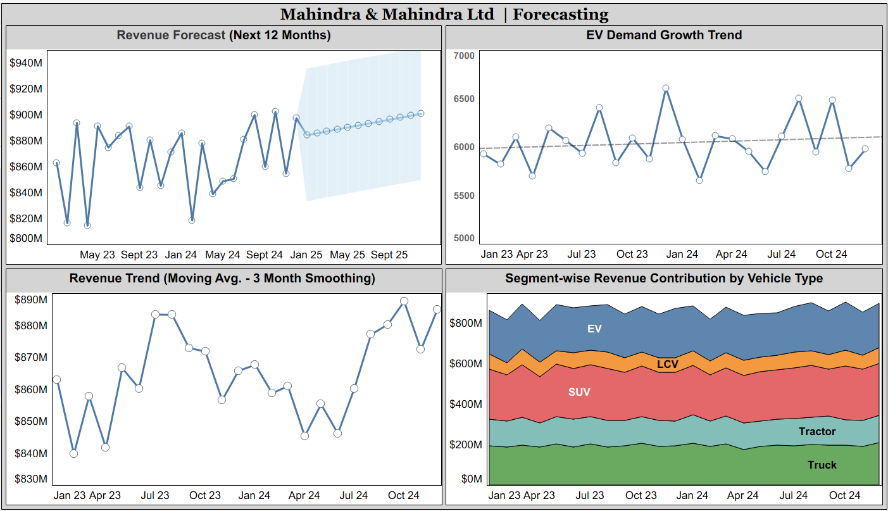

# Mahindra & Mahindra Business Analysis

# Company Name: Mahindra & Mahindra Ltd (M&M)

-----

### Tableau Public Dashboard Link:-
https://public.tableau.com/views/MM_Global_Sales_Dashboard/BusinessInsights?:language=en-US&:sid=&:redirect=auth&:display_count=n&:origin=viz_share_link
-----

### Project Summary:-
This project focuses on performing End-to-End Business Analysis & Future Forecasting for Mahindra & Mahindra using Python and Tableau.

The analysis covers:
  1. Revenue Growth Trends.
  2. Profitability Optimization.
  3. Customer Behavior Insights.
  4. Market Expansion Opportunities.
  5. Future Forecasting using Time-Series Techniques.

➣ The project is designed to simulate real-world business decision-making scenarios in the automotive industry.

-----

### Dataset Description (After Cleaning):-
The dataset consists of **100,000 records** with **15 structured columns**, representing global sales operations across **India and international markets**.

Key Highlights:-
1. Cleaned and standardized Region–Country–City hierarchy.
2. Derived business metrics like Profit Margin %.
3. Added time-based features (Month, Year).
4. Maintained realistic relationships:
- EV = Electric fuel only
- Profit = Revenue – Cost
6. Removed inconsistencies and ensured data integrity.

### Columns Name (Clean Data):-
- Date
- Region
- Country
- City
- Vehicle_Type
- Units_Sold
- Revenue_USD
- Cost_USD
- Profit_USD
- Sales_Channel
- Customer_Type
- Payment_Mode
- Fuel_Type
- Customer_Rating
- Discount_%
- Profit_Margin_%
- Year
- Month
- Month_Name

-----

### Tools and Techniques Used:-
- Python (Jupyter Notebook):
  - Data Cleaning.
  - Feature Engineering.
  - Time Series Forecasting (ARIMA).

- Tableau:
  - Interactive Dashboards.
  - Forecasting (built-in analytics).
  - Data Visualization.
 
 -----
 
### Business Objectives:-
1. Analyze Revenue Growth Trends.
2. Optimize Profitability & Cost Efficiency.
3. Understand Customer Behavior & Satisfaction.
4. Identify Market Expansion Opportunities.
5. Perform Future Sales Forecasting.

-----

### KPIs:-
- Total Revenue
- Total Profit
- Total Operating Cost
- Total Units Sold
- Profit Margin (%)

-----

### Key Analytical Insights:-
- **SUV segment generates the highest revenue contribution**.
- EV segment shows consistent growth, indicating future potential.
- Europe region contributes the highest revenue among global markets.
- Individual customers contribute more revenue than corporate clients.
- International markets outperform India in total revenue contribution.
- Profit margins are stable (~25%), indicating controlled cost structure.

-----

### Dashboard Preview:-
 

-----

### Key Learnings:-
- Importance of data cleaning and consistency in real-world datasets.
- Ability to connect business objectives with data insights.
- Hands-on experience in time-series forecasting.
- Strong understanding of Tableau dashboard design principles.
- Improved skills in data visualization.

-----

### Project Structure:-
- Mahindra_And_Mahindra_Business_Analysis
  - Analysis_Python/: Python Notebook.
  - Dashboard/: "M&M_Global_Sales_Dashboard.twbx" file.
  - Data/: Raw and Clean Dataset.
  - Insights/: Business Insights & Recommendations.
  - README.md: Project Documentation.
 
-----

### Key Outcome:-
- This project successfully demonstrates:
  - End-to-End Business Analytics Workflow.
  - Ability to derive actionable insights from large datasets.
  - Strong forecasting and visualization capabilities.

-----

### Author:-
Yash Sonar
BBA Student | Aspiring Data Analyst

-----
